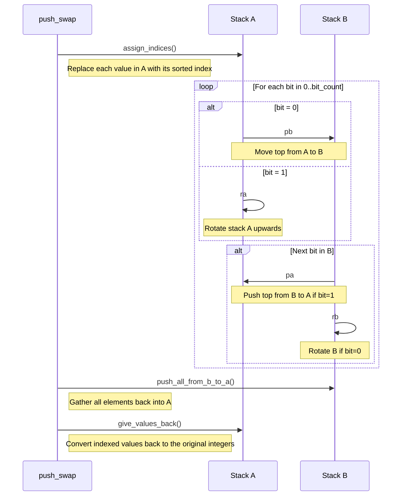

# 🧮 push_swap – Sorting algorithm


[](https://github.com/to0nsa/push_swap)


> **push_swap** is a 42 project that implements **sorting algorithms** with a restricted set of stack operations (push, swap, rotate). The goal is to sort a list of integers in as few moves as possible. I chose to implement radix sort algorithm and worked on a custom `ft_qsort`.

[🔗 View on GitHub](https://github.com/to0nsa/push_swap)
**[📚 View full documentation](https://to0nsa.github.io/push_swap/)**

---

## ✨ Features

<details>
<summary><strong> See features  </strong></summary>

**🔢 Custom Stack-Based Sorting Engine**
Implements a sorting algorithm using only a limited set of allowed operations: `sa`, `sb`, `pa`, `pb`, `ra`, `rb`, `rra`, `rrb`, and their combined forms.

**⚙️ Radix Sort for Large Inputs**
Efficiently handles large lists using a binary radix sort algorithm, minimizing the total number of operations while maintaining predictable performance.

**🧮 Custom ft_qsort for Index Assignment**
To prepare for radix sorting, the program generates a sorted reference array using a handcrafted `ft_qsort` function. It’s a lightweight, optimized implementation inspired by quicksort. This approach avoids external dependencies, offers full control over sorting behavior, and aligns with 42's constraint of using only custom code.

**🧠 Hardcoded Mini-Sort for 2–5 Elements**
Uses optimized, minimal instruction sets for very small stacks to ensure the fewest possible moves.

**🛡️ Strict Input Parsing and Validation**
Handles both quoted and space-separated arguments, validates integer range and format, checks for duplicates, and safely exits on error.

**📦 Modular and Maintainable Codebase**
Cleanly structured with separate directories for parsing, operations, sorting strategies, and utilities — with Doxygen-style comments for full documentation.

**🧪 Built-In Sorted Check**
Automatically exits without performing any operations if the input is already sorted.
</details>

---

## 💡 Why Radix Sort?

<details>
<summary><strong> See details  </strong></summary>
Radix sort is a strong choice for the push_swap project due to several key advantages:

**✅ Operation Count Efficiency**
Radix sort runs in O(n × k) time, where n is the number of elements and k is the number of bits needed to represent the largest number. This helps keep the total moves low, which is crucial for the push_swap project.

**✅ Stable and Predictable Behavior**
Radix sort offers deterministic performance, processing elements in a fixed number of bitwise passes. This consistency ensures a controlled, step-by-step sorting process without relying on input patterns — ideal for minimizing operations in a constrained environment like push_swap.

**✅ Bitwise-Friendly for Stack Logic**
Radix sort focuses on binary representations, which aligns naturally with low-level stack operations. Leveraging bit shifts (`>>`) and comparisons at the bit level complements the mechanics of `push_swap`.
</details>

---

## ⚙️ How Radix Sort Works

<details>
<summary><strong> See details  </strong></summary>
Radix sort in `push_swap` works by sorting integers based on their binary representation, one bit at a time. This process involves several clear steps:

**1. Assigning Sorted Indices**
First, the integers in Stack A are mapped to their respective indices in a sorted sequence:

- Input:	`[30, 10, 20]`
- Sorted:	`[10, 20, 30]`
- Indexed:	`[2, 0, 1]`

This indexing simplifies sorting by focusing on smaller, normalized values rather than larger integers.

**2. Determining Bit Count**
The algorithm calculates how many binary digits (bits) are required to represent the largest index. The number of bits required corresponds how many times you can shift the maximum index to the right (>> 1) until it becomes zero.

- Highest index: 5 → binary: 101 → Bit count: 3

This tells you how many passes of sorting the algorithm will need to do in the bitwise loop.

**3. Bitwise Sorting Loop**
For each bit position (from the least significant bit to the most significant bit):
- **Partition Stack A by Current Bit**
	- Look at the top of Stack A.
	- If the current bit = 0: perform a pb (push) to Stack B.
		- This effectively collects all “0-bit” elements in Stack B.
	- If the current bit = 1: perform a ra (rotate) on Stack A.
		- This rotates “1-bit” elements to the bottom of Stack A, keeping them in place while it moves through all elements.
	- Repeat until every element is processed in Stack A once for this bit position.

- **Process Stack B for the Next Bit** 
	- Rotate or push elements from Stack B back to A based on the next bit.
	- If the next bit = 1: push elements back to Stack A.
	- If the next bit = 0: rotate elements within Stack B.
	- This approach helps keep stacks from getting unbalanced or from losing track of already-sorted bits.

- **Increment the Bit Position**
	- Move on to the next more significant bit and repeat the same pushing/rotating process.
	- Continue until all bits are processed (up to the bit count from step 2).

**Why This Works ?**
By pushing “0” elements to Stack B and rotating “1” elements within Stack A, each pass of the bit sorting groups elements according to whether they have a 0 or 1 in the current bit position. After enough passes (equal to the total bits needed), all elements end up fully sorted in ascending order of their indices.

**4. Restoring Original Values**
- Gather elements back into A
- After sorting, indices are mapped back to their original integer values, resulting in a fully sorted stack.

🧮 **Radix Sort Flow** – Sequence Diagram


**💡 Why This Works Efficiently**
This binary approach guarantees sorting in O(n × k) complexity, where n is the number of elements and k is the number of bits. Unlike traditional sorting algorithms that depend on element comparisons, radix sort operates directly on bits, offering predictable and efficient performance.
</details>

---

## ⚡️ Performance

<details>
<summary><strong> See details  </strong></summary>
Tested on a local machine using randomized input sets with output redirected
to `/dev/null` to exclude printing time.

| Input Size | Execution Time       | Approx. Operation Count  |
|------------|----------------------|--------------------------|
| 100        | ~0.004s              | 855/857 ops              |
| 500        | ~0.012s              | 5739/5741 ops            |
| 1000       | ~0.037s              | 12730/12732 ops          |
| 10000      | ~3.9s                | 170953/170956 ops        |

> ⏱️ **Command used:**  
> `time ./push_swap $(shuf -i 1-10000 -n 10000) > /dev/null`

> 📌 **Note:** Results may vary slightly based on hardware, compiler flags, and system load. And results are bound to the constraints of the project no multi-threading, pur C logic & stack ops, and no optimization flags.

</details>

---
## 🚀 Usage

<details>
<summary><strong> See features  </strong></summary>
**1. To compile executables:** 🛠️
```bash
make
```
> **Note:** This project uses [libft](https://github.com/to0nsa/libft) as a git submodule.
If you're cloning the repository for the first time, don't forget to initialize and update submodules:
```bash
git clone --recurse-submodules https://github.com/to0nsa/minitalk.git
```
or if you already cloned it:
```bash
git submodule update --init --recursive
```

**Run the program:**
**Example 1:** basic
```bash
./push_swap 9 3 4 6 7
```
Output:
```bash
ra
pb
pb
pa
pa
```
**Example 2:** use of environment variable and `checker_linux` that is provided (check if the stack/array is sorted)
```bash
ARGS='9 3 4 6 7'; ./push_swap $ARGS | ./checker_linux $ARGS
```
Output:
```bash
OK
```
**Example 3:** use of environment variable and line count to evaluate the number of operation used
```bash
ARGS='9 3 4 6 7'; ./push_swap $ARGS | wc -l
```
Output:
```bash
5
```
</details>

---
## 📝 License

This project is licensed under the [MIT License](LICENSE).

You are free to use, modify, and distribute this code for academic, personal, or professional purposes. Attribution is appreciated but not required.

---

## 📬 Contact

If you have any questions, suggestions, or feedback, feel free to reach out:

- **📧 Email:** nicolas.lovis@hotmail.fr
- **💻 GitHub:** [github.com/to0nsa](https://github.com/to0nsa)

You're also welcome to open an issue or leave a comment on the repository.